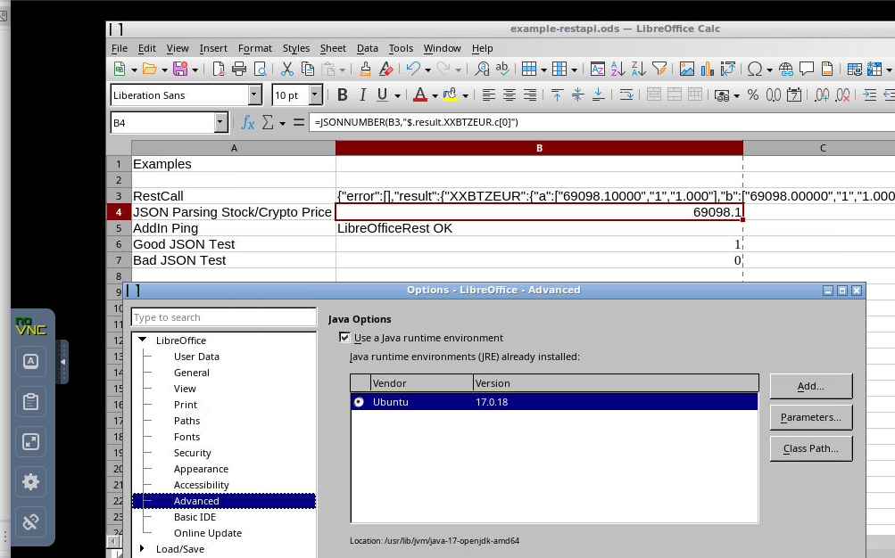
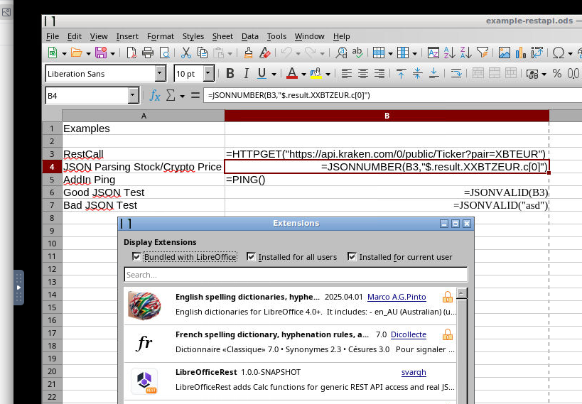

# libreoffice-addons

Small AI generated LibreOffice add-ons collected in one repository.

## Quick download

- Check github releases page: `https://github.com/svargh/libreoffice-addons/releases`

## Extension LibreOfficeRest
`LibreOfficeRest/`  
Calc Java Add-In for REST calls using SpringWebclient and JSONPath extraction.    

Example 1:

Example 2:
